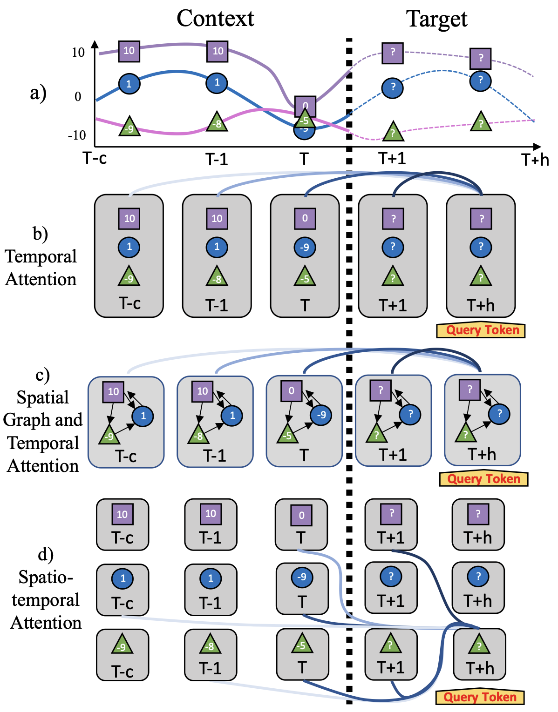
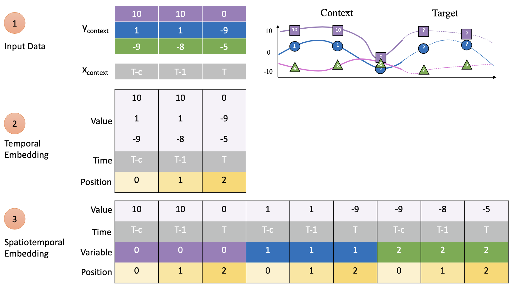
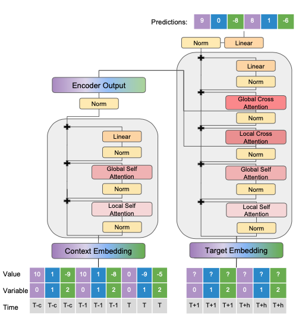
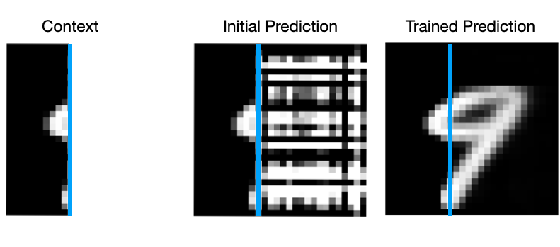

# Spacetimeformer Multivariate Forecasting

This repository contains the code for the paper, "**Long-Range Transformers for Dynamic Spatiotemporal Forecasting**", Grigsby et al., 2021. ([arXiv](https://arxiv.org/abs/2109.12218)). 

**Spacetimeformer** is a Transformer that learns temporal patterns like a time series model and spatial patterns like a Graph Neural Network.

Below we give a brief explanation of the problem and method with installation instructions. We provide training commands for high-performance results on several datasets.

**NEW MARCH 2023! We have updated the public version of the paper to v3 - the final major update expected. See the v3 release notes below.**

## Data Format
We deal with multivariate sequence to sequence problems that have continuous inputs. The most common example is time series forecasting where we make predictions at future ("target") values given recent history ("context"):


Every model and dataset uses this `x_context`, `y_context`, `x_target`, `y_target` format. X values are time covariates like the calendar datetime, while Ys are variable values. There can be additional context variables that are not predicted. 


## Spatiotemporal Attention
Typical deep learning time series models group Y values by timestep and learn patterns across time. When using Transformer-based models, this results in "*temporal*" attention networks that can ignore *spatial* relationships between variables.

In contrast, Graph Neural Networks and similar methods model spatial relationships with explicit graphs - sharing information across space and time in alternating layers.

Spactimeformer learns full spatiotemporal patterns between all varibles at every timestep.



We implement spatiotemporal attention with a custom Transformer architecture and embedding that flattens multivariate sequences so that each token contains the value of a single variable at a given timestep:



Spacetimeformer processes these longer sequences with a mix of efficient attention mechanisms and Vision-style "windowed" attention.



This repo contains the code for our model as well as several high-quality baselines for common benchmarks and toy datasets.

## Paper v3 Release Notes 
The Spacetimeformer project began in 2021. The project underwent a major revision in summer 2022, with most of the updates being merged to the public codebase shortly thereafter. However, the updated version of the paper was not released until March 2023. Here we summarize the major changes:

- **Updated Experimental Results and Additional Datasets**. Spacetimeformer's L * N spatiotemporal attention format is super flexible but inherently GPU-intensive. We are now able to scale the method to much larger datasets and model sizes. As part of this process we added many new datasets to the codebase - far more than are mentioned in the paper. The model and training routines now also support exogenous variables and mixed-length context sequences.

- **Implementation Changes and Scalability Improvements**. Learnable position embeddings and other Transformer architecture adjustments including windowed attention for long sequences.

- **Time Series Tricks and Non-Stationarity**. The most common case where timeseries Transformers fail is due to distribution shift between the train and test splits, which often happens in forecasting when long-term trends change the magnitude of test-time sequences. In these situations it [has been shown that simple linear models can outperform larger Transformers](https://arxiv.org/abs/2205.13504). All models in this repo (including Spacetimeformer) now have options for input normalization, seasonal decomposition, and linear output components that greatly reduce this effect.

- **Spatiotemporal Attention's Improvements over ST-GNNs and Connections to Vision Transformers**. The original purpose of our multivariate sequence format was to provide an easy-to-implement alternative to more complex GNN operations that combined the advantages of timeseries Transformers. What was not fully clear at the time is how the full (L * N)^2 attention graph can provide a context-dependent and fully spatiotemporal graph learning mechanism. Since 2021, it has also become much easier to motivate Spacetimeformer as a Vision Transformer analogue for time series forecasting. See Appendix A2 and A3 for detailed discussions.


## Installation and Training
This repository was written and tested for **python 3.8** and **pytorch 1.11.0**. Note that the training process depends on specific (now outdated) versions of [pytorch lightning](https://github.com/Lightning-AI/lightning) and torchmetrics.

```bash
git clone https://github.com/QData/spacetimeformer.git
cd spacetimeformer
conda create -n spacetimeformer python==3.8
conda activate spacetimeformer
pip install -r requirements.txt
pip install -e .
```
This installs a python package called ``spacetimeformer``. The package does not install pytorch or torchvision automatically, and you should [follow the official pytorch installation instructions for 1.11](https://pytorch.org/get-started/previous-versions/) depending on your CUDA software version.


Commandline instructions for each experiment can be found using the format: ```python train.py *model* *dataset* -h```. 

#### Models
- `linear`: a basic autoregressive linear model. *New June 2022: expanded to allow for seasonal decomposition and independent params for each variable (inspired by [DLinear](https://arxiv.org/abs/2205.13504))*.
- `lstnet`: a more typical RNN/Conv1D model for multivariate forecasting. Based on the attention-free implementation of [LSTNet](https://github.com/laiguokun/LSTNet).
- `lstm`: a typical encoder-decoder LSTM without attention. We use scheduled sampling to anneal teacher forcing throughout training.
- `mtgnn`: a hybrid GNN that learns its graph structure from data. For more information refer to the [paper](https://arxiv.org/abs/2005.11650). We use the implementation from [`pytorch_geometric_temporal`](https://github.com/benedekrozemberczki/pytorch_geometric_temporal) (*requires some extra installation*).
- `s4`: long-sequence state-space model ([paper](https://arxiv.org/abs/2111.00396)) (*requires some extra installation*).
- `heuristic`: simple heuristics like "repeat the last value in the context sequence" as a sanity-check.
- `spacetimeformer`: the multivariate long-range transformer architecture discussed in our paper.
    - note that the "Temporal" ablation discussed in the paper is a special case of the `spacetimeformer` model. It is conceptually similar to [Informer](https://arxiv.org/abs/2012.07436). Set the `embed_method = temporal`. Spacetimeformer has many configurable options and we try to provide a thorough explanation with the commandline `-h` instructions.


#### Datasets

###### Spatial Forecasting
- `metr-la` and `pems-bay`: traffic forecasting datasets. We use a very similar setup to [DCRNN](https://github.com/liyaguang/DCRNN).
- `precip`: daily precipitation data from a latitude-longitude grid over the Continental United States. 
- `hangzhou`: metro station ridership data.

###### Time Series Forecasting
- `toy2`: is the toy dataset mentioned at the beginning of our experiments section. It is heavily based on the toy dataset in [TPA-LSTM](https://arxiv.org/abs/1809.04206.).
- `asos`: is the codebase's name for what the paper calls "NY-TX Weather."
- `solar_energy`: Is the codebase's name for the time series benchmark more commonly called "AL Solar."
- `exchange`: A common time series benchmark dataset of exchange rates.
- `weather`: A common time series benchmark dataset of 21 weather indiciators.
- `ettm1`: A common time series benchmark dataset of "electricity transformer temperatures" and related variables.
- `traffic`: More of a spatial-temporal benchmark for forecasting traffic conditions in 800+ roadlanes. There is no roadmap/graph provided, so this makes for a good demo of Spacetimeformer's automatic spatial learning. However, sequence lengths can be very long and this dataset has meaningful distribution shift.

###### Image Completion
- `mnist`: Highlights the similarity between multivariate forecasting and vision models by completing the right side of an MNIST digit given the left side, where each row is a different variable.
- `cifar`: A harder image completion task where the variables are color channels and the sequence is flattened across rows.

###### Copy Tasks
- `copy`: Copy binary input sequences with rows shifted by varying amounts. An example of a hard task for Temporal attention that is easy for Spatiotemporal attention.
- `cont_copy`: A continuous version of the copy task with additional settings to study distribution shift.

###### "Global" or Multiseries Datasets

- `m4`: The M4 competition dataset ([overview](https://www.sciencedirect.com/science/article/pii/S0169207019301128)). Collection of 100k univariate series at various resolutions.
- `wiki`: The Wikipedia web traffic dataset from the [Kaggle competition](https://www.kaggle.com/c/web-traffic-time-series-forecasting). 145k univariate high-entropy series at a single resolution.
- `monash`: Loads the [Monash Time Series Forecasting Archive](https://arxiv.org/abs/2105.06643). Up to ~400k time univariate timeseries.

    *(We load these benchmarks in an unusual format where the context sequence is *all data up until the current time* - leading to variable length sequences with padding.)*

### Logging with Weights and Biases
We used [wandb](https://wandb.ai/home) to track all of results during development, and you can do the same by providing your username and project as environment variables:
```bash
export STF_WANDB_ACCT="your_username"
export STF_WANDB_PROJ="your_project_title"
# optionally: change wandb logging directory (defaults to ./data/STF_LOG_DIR)
export STF_LOG_DIR="/somewhere/with/more/disk/space"
```
wandb logging can then be enabled with the `--wandb` flag.

There are several figures that can be saved to wandb between epochs. These vary by dataset but can be enabled with `--attn_plot` (for Transformer attention diagrams) and `--plot` (for prediction plotting and image completion).


## Example Training Commands

###### General Notes: 
1. Commands are listed without GPU counts. For one GPU, add `--gpus 0`, three GPUs: `--gpus 0 1 2` etc. Some of these models require significant GPU memory (A100 80GBs). Other hyperparameter settings were used in older versions of the paper with more limited compute resources. If I have time I will try to update with competetive alternatives on smaller GPUs.

2. Some datasets require a `--data_path` to the dataset location on disk. Others are included with the source code or downloaded automatically.

Linear autoregressive model with independent weights and seasonal decomposotion (DLinear-style) on ETTm1:
```bash
python train.py linear ettm1 --context_points 288 --target_points 96 --run_name linear_ettm1_regression --gpus 0 --use_seasonal_decomp --linear_window 288 --data_path /path/to/ETTm1.csv
```

Spacetimeformer on Pems-Bay (MAE: ~1.61):
```bash
python train.py spacetimeformer pems-bay --batch_size 32 --warmup_steps 1000 --d_model 200 --d_ff 700 --enc_layers 5 --dec_layers 6 --dropout_emb .1 --dropout_ff .3 --run_name pems-bay-spatiotemporal --base_lr 1e-3 --l2_coeff 1e-3 --loss mae --data_path /path/to/pems_bay/ --d_qk 30 --d_v 30 --n_heads 10 --patience 10 --decay_factor .8
```

Spacetimeformer on MNIST completion:
```bash
python train.py spacetimeformer mnist --embed_method spatio-temporal --local_self_attn full --local_cross_attn full --global_self_attn full --global_cross_attn full --run_name mnist_spatiotemporal --context_points 10
```


Spacetimeformer on AL Solar (MSE: ~7.75):
```bash
python train.py spacetimeformer solar_energy --context_points 168 --target_points 24 --d_model 100 --d_ff 400 --enc_layers 5 --dec_layers 5 --l2_coeff 1e-3 --dropout_ff .2 --dropout_emb .1 --d_qk 20 --d_v 20 --n_heads 6 --run_name spatiotemporal_al_solar --batch_size 32 --class_loss_imp 0 --initial_downsample_convs 1 --decay_factor .8 --warmup_steps 1000
```

More Coming Soon...

## Citation
If you use this model in academic work please feel free to cite our paper

```
@misc{grigsby2021longrange,
      title={Long-Range Transformers for Dynamic Spatiotemporal Forecasting}, 
      author={Jake Grigsby and Zhe Wang and Yanjun Qi},
      year={2021},
      eprint={2109.12218},
      archivePrefix={arXiv},
      primaryClass={cs.LG}
}
```
