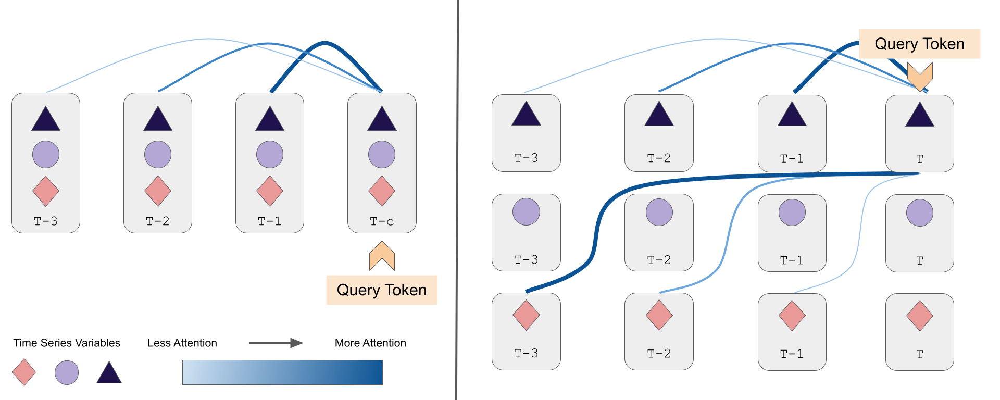
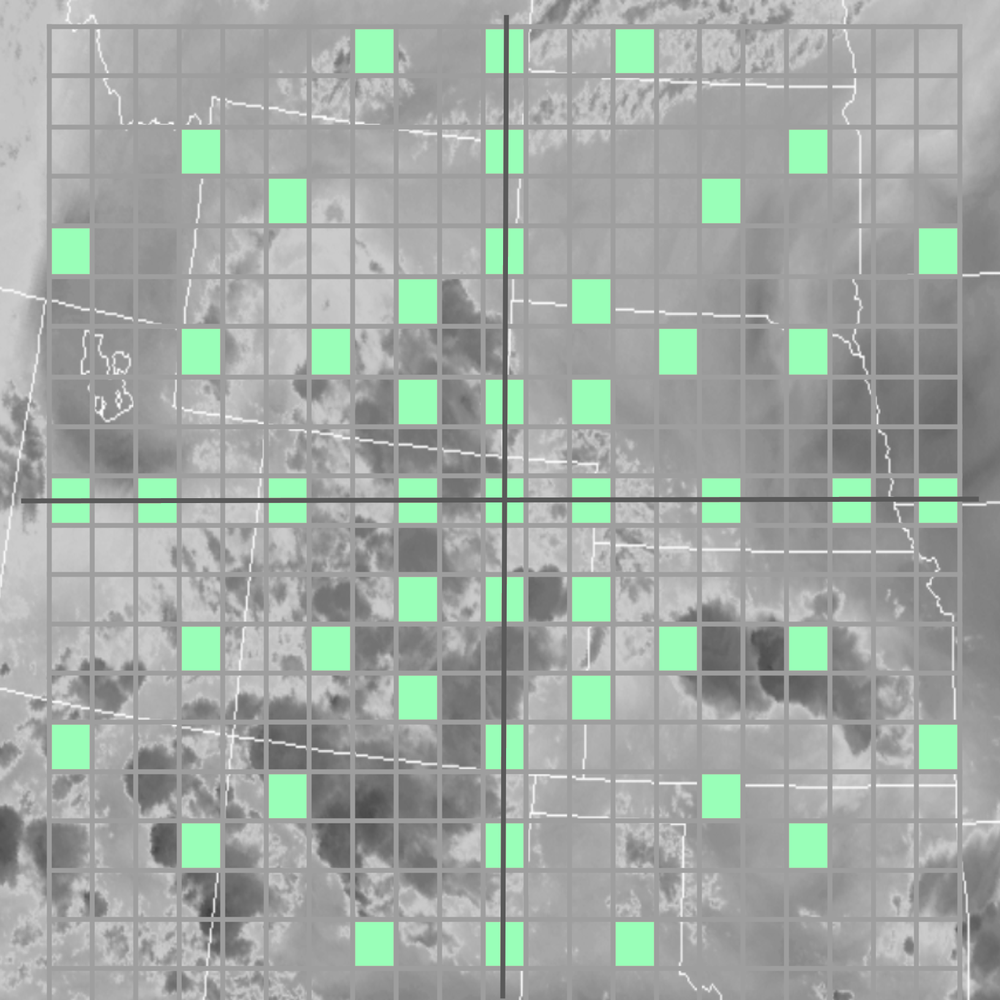
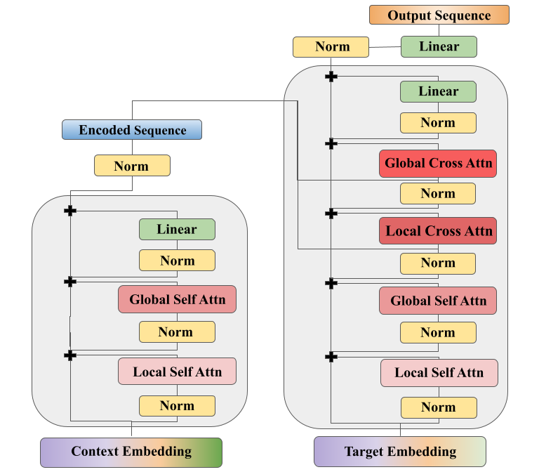
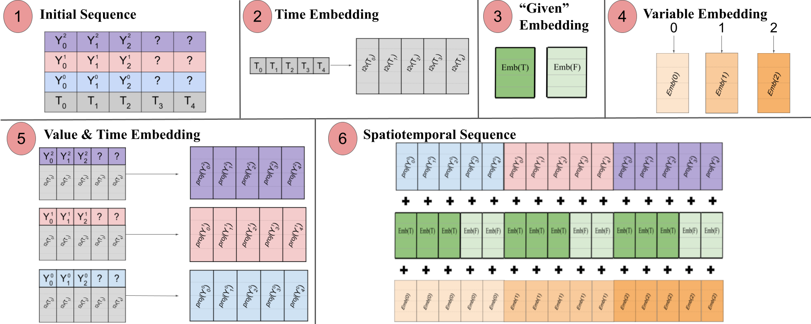

# Spacetimeformer Multivariate Forecasting

This repository contains the code for the paper, "**Long-Range Transformers for Dynamic Spatiotemporal Forecasting**", Grigsby, Wang and Qi, 2021. ([arxiv](https://arxiv.org/abs/2109.12218))



Transformers are a high-performance approach to sequence-to-sequence timeseries forecasting. However, stacking multiple sequences into each token only allows the model to learn *temporal* relationships across time. This can ignore important *spatial* relationships between variables. Our model (nickamed "Spacetimeformer") flattens multivariate timeseries into extended sequences where each token represents the value of one variable at a given timestep. Long-Range Transformers can then learn relationships over both time and space. For much more information, please refer to our paper.

### We will be adding additional instructions, example commands and dataset links in the coming days.

## Installation 
This repository was written and tested for **python 3.8** and **pytorch 1.9.0**.

```bash
git clone https://github.com/UVA-MachineLearningBioinformatics/spacetimeformer.git
cd spacetimeformer
conda create -n spacetimeformer python==3.8
source activate spacetimeformer
pip install -r requirements.txt
pip install -e .
```
This installs a python package called ``transformer_timeseries``.

## Dataset Setup
CSV datsets like AL Solar, NY-TX Weather, Exchange Rates, and the Toy example are included with the source code of this repo. 

Larger datasets should be downloaded and their folders placed in the `data/` directory. You can find them with this [google drive link](https://drive.google.com/drive/folders/1NcCIjuWbkvAi1MZUpYBIr7eYhaowvU7B?usp=sharing). Note that the `metr-la` and `pems-bay` data is directly from [this repo](https://github.com/liyaguang/DCRNN) - all we've done is skip a step for you and provide the raw train, val, test, `*.npz` files our dataset code expects.


## Recreating Experiments with Our Training Script
The main training functionality for `spacetimeformer` and most baselines considered in the paper can be found in the `train.py` script. The training loop is based on the [`pytorch_lightning`](https://pytorch-lightning.rtfd.io/en/latest/) framework.

Commandline instructions for each experiment can be found using the format: ```python train.py *model* *dataset* -h```. 

Model Names:
- `linear`: a basic autoregressive linear model.
- `lstnet`: a more typical RNN/Conv1D model for multivariate forecasting. Based on the attention-free implementation of [LSTNet](https://github.com/laiguokun/LSTNet).
- `lstm`: a typical encoder-decoder LSTM without attention. We use scheduled sampling to anneal teacher forcing throughout training.
- `mtgnn`: a hybrid GNN that learns its graph structure from data. For more information refer to the [paper](https://arxiv.org/abs/2005.11650). We use the implementation from [`pytorch_geometric_temporal`](https://github.com/benedekrozemberczki/pytorch_geometric_temporal)
- `spacetimeformer`: the multivariate long-range transformer architecture discussed in our paper.
    - note that the "Temporal" ablation discussed in the paper is a special case of the `spacetimeformer` model. Set the `embed_method = temporal`. Spacetimeformer has many configurable options and we try to provide a thorough explanation with the commandline `-h` instructions.


Dataset Names:
- `metr-la` and `pems-bay`: traffic forecasting datasets. We use a very similar setup to [DCRNN](https://github.com/liyaguang/DCRNN).
- `toy2`: is the toy dataset mentioned at the beginning of our experiments section. It is heavily based on the toy dataset in [TPA-LSTM](https://arxiv.org/abs/1809.04206.).
- `asos`: Is the codebase's name for what the paper calls "NY-TX Weather."
- `solar_energy`: Is the codebase's name for what is more commonly called "AL Solar."
- `exchange`: A dataset of exchange rates. Spacetimeformer performs relatively well but this is tiny dataset of highly non-stationary data where `linear` is already a SOTA model.
- `precip`: A challenging spatial message-passing task that we have not yet been able to solve. We collected daily precipitation data from a latitude-longitude grid over the Continental United States. The multivariate sequences are sampled from a ringed "radar" configuration as shown below in green. We expand the size of the dataset by randomly moving this radar around the country.

<p align="center">

</p>

### Logging with Weights and Biases
We used [wandb](https://wandb.ai/home) to track all of results during development, and you can do the same by hardcoding the correct organization/username and project name in the `train.py` file. Comments indicate the location
near the top of the `main` method. wandb logging can then be enabled with the `--wandb` flag.

There are two automated figures that can be saved to wandb between epochs. These include the attention diagrams (e.g., Figure 4 of our paper) and prediction plots (e.g., Figure 6 of our paper). Enable attention diagrams with `--attn_plot` and prediction curves with `--plot`.

### Example Spacetimeformer Training Commands
Toy Dataset
```bash
python train.py spacetimeformer toy2 --run_name spatiotemporal_toy2 \
--d_model 100 --d_ff 400 --enc_layers 4 --dec_layers 4 \
--gpus 0 1 2 3 --batch_size 32 --start_token_len 4 --n_heads 4 \
--grad_clip_norm 1 --early_stopping --trials 1
```

Metr-LA
```bash
python train.py spacetimeformer metr-la --start_token_len 3 --batch_size 32 \
--gpus 0 1 2 3 --grad_clip_norm 1 --d_model 128 --d_ff 512 --enc_layers 5 \
--dec_layers 4 --dropout_emb .3 --dropout_ff .3 --dropout_qkv 0 \ 
--run_name spatiotemporal_metr-la --base_lr 1e-3 --l2_coeff 1e-2 \
```

Temporal Attention Ablation with Negative Log Likelihood Loss on NY-TX Weather ("asos") with WandB Loggin and Figures
```bash
python train.py spacetimeformer asos --context_points 160 --target_points 40 \ 
--start_token_len 8 --grad_clip_norm 1 --gpus 0 --batch_size 128 \ 
--d_model 200 --d_ff 800 --enc_layers 3 --dec_layers 3 \
--local_self_attn none --local_cross_attn none --l2_coeff .01 \
--dropout_emb .1 --run_name temporal_asos_160-40-nll --loss nll \
--time_resolution 1 --dropout_ff .2 --n_heads 8 --trials 3 \ 
--embed_method temporal --early_stopping --wandb --attn_plot --plot
```


## Using Spacetimeformer in Other Applications
If you want to use our model in the context of other datasets or training loops, you will probably want to go a step lower than the `spacetimeformer_model.Spacetimeformer_Forecaster` pytorch-lightning wrapper. Please see `spacetimeformer_model.nn.Spacetimeformer`.


## Citation
If you use this model in academic work please feel free to cite our paper

```
@misc{grigsby2021longrange,
      title={Long-Range Transformers for Dynamic Spatiotemporal Forecasting}, 
      author={Jake Grigsby and Zhe Wang and Yanjun Qi},
      year={2021},
      eprint={2109.12218},
      archivePrefix={arXiv},
      primaryClass={cs.LG}
}
```




